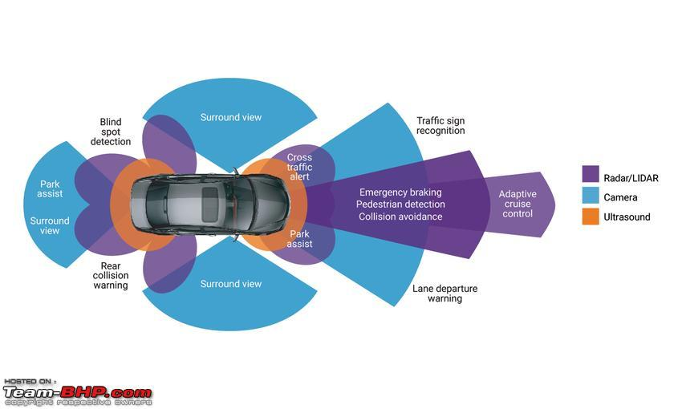
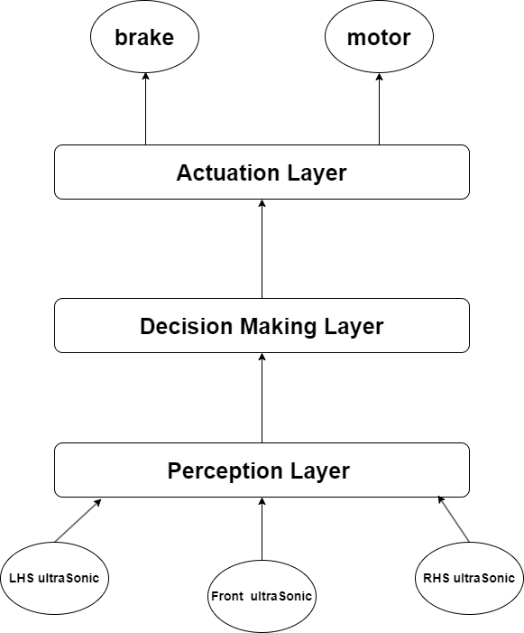

# ADAS with SDV BareMetal Development

## this is the full Advanced Driving Assistance System with Software Defined vehicles 

The bare-metal portion of the ADAS with SDV (Advanced Driving Assistance Systems with Software Defined Vehicles) project is implemented on an STM32 microcontroller, focusing on real-time control and direct hardware interfacing, enhanced by the use of a Real-Time Operating System (RTOS). This system is responsible for time-critical ADAS functionalities and implements two key SDV layers: perception and actuation. The perception layer handles sensor data acquisition, while the actuation layer manages motor control and safety feature execution, including Emergency Braking. By using a bare-metal approach, the system achieves low-latency responses and deterministic behavior—both critical for ensuring reliable and safe operation in automotive environments.

### ADAS features

### System Layers

