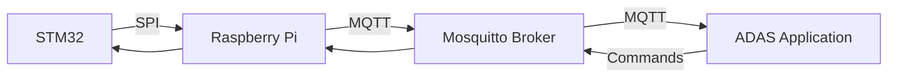

#  SPI-MQTT Communication Gateway 🚀


A high-performance bridge between STM32 (via SPI) and Raspberry Pi (via MQTT) for real-time sensor data and actuator control in ADAS/IoT systems.

This application facilitates bidirectional seamless communication between an STM32 microcontroller and a Raspberry Pi 4. It:

- Reads sensor data (ultrasonic distances) from the STM32 and publishes them to an MQTT broker.
- Subscribes to actuator commands (e.g., brake) and forwards them to the STM32.
- Designed for ADAS (Advanced Driver Assistance Systems) or IoT edge computing.

---

## 📖 Table of Contents
- [Key Features](#features) 
- [Architecture](#architecture)
- [Technical Implementation](#implementation)
- [Requirements](#requirements)
- [Docker Deployment](#docker)
---

## <a id="features"></a>✨ Key Features

| Feature                         | Description                                                                     |
|---------------------------------|---------------------------------------------------------------------------------|
| **Bidirectional Communication** | SPI-to-MQTT for sensors, MQTT-to-SPI for actuators                              |
| **Thread-Safe**                 | Lock-protected SPI operations & queue-based command processing                  |
| **Self-Healing**                | Auto-reconnects to MQTT broker on failure                                       | 
| **Modular Design**              | JSON-configurable topics and parameters                                         |
| **Error Handling**              | Logs SPI/MQTT errors and falls back to defaults if config.json is missing.      |
| **Diagnostics**                 | Heartbeat monitoring + detailed logging for tracking info, warnnings or errors. |
| **Clean Shutdown**	            | Gracefully closes SPI/MQTT connections on exit or failure.                      |

---

## <a id="architecture"></a>🏗 Architecture



---

## <a id="implementation"></a>🛠 Technical Implementation

### 1. SPI Communication
- Protocol: Uses spidev to read sensor data in the format [0xA0, front, left, right, 0xB0].

- Thread Safety: SPI operations are protected by threading.Lock() to prevent race conditions.

### 2. MQTT Integration
- Broker: Connects to Mosquitto (default: localhost:1883).

- Topics:

    Publishes: `sensors/front`, `sensors/left`, `sensors/right`, `sensors/heartbeat`.

    Subscribes: `actuators/break` (for brake commands).

- Last Will Testament (LWT): Notifies if the Pi disconnects unexpectedly.

### 3. Logging
- Logs critical events (e.g., SPI failures, MQTT disconnections, Sensor Readings) via Python’s logging module.

---

## <a id="requirements"></a>📌 Requirements

### Hardware

- Raspberry Pi 4 (ARMv8)

- STM32 microcontroller

- SPI-enabled sensors

### Software

- Python3

- Paho-mqtt

- Spidev

- Mosquitto Broker

#### You can install them from the following bash script, just hit copy and paste them in your terminal!
```
# Core dependencies
$ sudo apt install python3 python3-pip
$ pip install paho-mqtt spidev

# Optional for MQTT broker
$ sudo apt install mosquitto mosquitto-clients
```
---

## <a id="docker"></a>🐳 Docker Deployment

1. Create a Dockerfile:
```
FROM python:3.9-slim
WORKDIR /app
COPY . .
RUN pip install paho-mqtt spidev
CMD ["python", "SPI_MQTT_communication_1.0.py"]
```
2. Build and Run:
```
docker build -t spi-mqtt-gateway .
docker run --device /dev/spidev0.0:/dev/spidev0.0 --network host spi-mqtt-gateway
```
